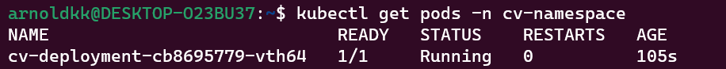
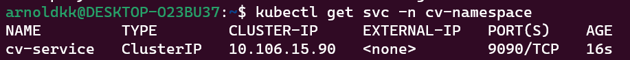

# To deploy the application in kubernetes follow the steps below

# create namespace of the cv application
kubectl create -f cv-app-namespace.yaml

# start the deployment using
 kubectl create -f cv-app-deployment.yaml

## check if pod is running
  kubectl get pods -n cv-namespace

# start the service
kubectl get svc -n cv-namespace

## check if service was started successfully
kubectl describe svc cv-service -n cv-namespace

# start ingress
kubectl create -f cv-app-ingress.yaml 

kubectl describe ingress cv-ingress -n cv-namespace

# NB:
To install and get started with nginx ingress follow this link https://kubernetes.github.io/ingress-nginx/deploy/#quick-start 

